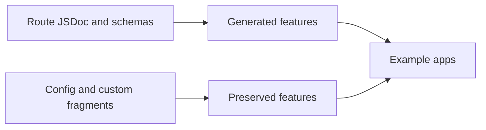

# Example App Coverage Plan

This document serves two jobs:

1. It is the current guide to which example app demonstrates which feature area.
2. It defines the route packs and follow-on work needed to grow the example
   suite without turning every app into the same demo.

It complements:

- [getting-started](./getting-started.md) for config setup
- [jsdoc-reference](./jsdoc-reference.md) for route-level tags
- [openapi-version-coverage](./openapi-version-coverage.md) for version-specific behavior
- [workflows-and-integrations](./workflows-and-integrations.md) for adoption stories

## Quick example picker

Open one of these first based on what you want to evaluate:

- `apps/next-app-zod`: Zod-first usage and the primary OpenAPI `3.2.0` showcase
- `apps/next-app-typescript`: TypeScript-first contracts and inferred type flows
- `apps/next-app-mixed-schemas`: mixed `zod`, `typescript`, and `schemaFiles`
- `apps/next-app-drizzle-zod`: Drizzle and `drizzle-zod` integration
- `apps/next-pages-router`: legacy Pages Router support
- `apps/tanstack-app`: TanStack Router framework parity
- `apps/react-router-app`: React Router framework parity
- `apps/next-app-next-config`, `apps/next-app-ts-config`, `apps/next-app-adapter`: config and adapter integration paths
- `apps/next-app-sandbox`: edge-case route behavior and exclusion coverage
- `apps/next-app-scalar`, `apps/next-app-swagger`: docs UI scaffolding variants

## Coverage model

The example suite should cover two classes of functionality:

1. Generated features that come directly from route metadata, schemas, and type
   inference.
2. Preserved features that come from `next.openapi.json`, `schemaFiles`, or
   custom OpenAPI fragments.

## App responsibility matrix

Each app should have a clear primary job. New routes should deepen that job
first, then add parity coverage only when it improves cross-framework
confidence.

| App                           | Primary responsibility                                           | Secondary coverage                                                 |
| ----------------------------- | ---------------------------------------------------------------- | ------------------------------------------------------------------ |
| `apps/next-app-zod`           | Main Zod example and primary OpenAPI `3.2.0` showcase            | Query/body/response examples, streaming, rich tags                 |
| `apps/next-app-typescript`    | TypeScript utility types, inferred types, generic wrappers       | Header/cookie params, redirects, downloads                         |
| `apps/next-app-mixed-schemas` | Mixed `zod` + `typescript` + `schemaFiles`                       | Preserved OpenAPI fragments, callbacks, links, reusable components |
| `apps/next-app-drizzle-zod`   | Drizzle and drizzle-zod examples, multi-resource relational APIs | Filters, sorting, batch operations, relation responses             |
| `apps/next-app-sandbox`       | Route-group and edge-case playground                             | `@ignore`, internal/admin routes, optional/nullish coverage        |
| `apps/next-pages-router`      | Pages Router parity and `@method` coverage                       | Shared route packs adapted to default-export handlers              |
| `apps/tanstack-app`           | TanStack Router framework parity                                 | Compact auth, multipart, response-set, loader/action coverage      |
| `apps/react-router-app`       | React Router framework parity                                    | Compact auth, multipart, response-set, loader/action coverage      |
| `apps/next-app-adapter`       | Adapter-stage generation smoke coverage                          | One advanced route family proving adapter support                  |
| `apps/next-app-next-config`   | `next-openapi` config through Next config integration            | One advanced route family proving config wiring                    |
| `apps/next-app-ts-config`     | Typed config smoke coverage                                      | One advanced route family proving config loading                   |
| `apps/next-app-scalar`        | Scalar UI example                                                | Reuse baseline App Router route surface                            |
| `apps/next-app-swagger`       | Swagger UI example                                               | Reuse baseline App Router route surface                            |

## Shared route packs

These route packs should be reused across apps, but not every app needs every
pack at the same depth.

### Baseline pack

Use for every primary example app:

- list, detail, create, replace, patch, delete
- path params, query params, explicit body and response schemas
- `204` responses
- `@responseSet` plus route-level `@add`
- explicit `@operationId` on at least one route

### Transport pack

Use where the framework and schema style can demonstrate it clearly:

- multipart upload with `@contentType multipart/form-data`
- binary download
- plain text or HTML response
- redirect response with `Location`
- non-JSON content type

### Security pack

Use in TypeScript, Zod, and framework parity apps:

- bearer auth
- API key or partner token
- cookie or header auth
- alternative security requirements via comma-separated `@auth`
- per-operation overrides

### Async and streaming pack

Use especially in the OpenAPI 3.2 showcase app:

- SSE or record-oriented stream
- `@responseContentType`
- `@responseItem`
- `@responseItemEncoding`
- `@responsePrefixEncoding`

### Examples pack

Use wherever route docs should demonstrate rich examples:

- inline examples
- exported typed examples
- serialized examples
- external examples
- querystring examples
- streaming examples

### Deprecation and migration pack

Use to demonstrate long-lived API evolution:

- `@deprecated`
- old/new route pairs
- versioned tags
- custom `@operationId`

## OpenAPI 3.2 showcase plan

`apps/next-app-zod` already targets `3.2.0`, so it should become the main
first-class route showcase for 3.2 tags from
[jsdoc-reference](./jsdoc-reference.md).

### Route-generated 3.2 features

Add at least one route family that exercises:

- `@tagSummary`
- `@tagKind`
- `@tagParent`
- `@querystring`
- `@responseContentType`
- `@responseItem`
- `@responseItemEncoding`
- `@responsePrefixEncoding`
- rich `@examples`

Recommended route family:

- `api/events/stream`
- `api/reports/export`
- `api/search/advanced`

### Preserved 3.2 features

Keep these in config or `schemaFiles` instead of forcing them into route tags:

- root `$self`
- `servers[].name`
- `oauth2MetadataUrl`
- OAuth `deviceAuthorization`
- example objects with `dataValue`, `serializedValue`, and `externalValue`
- discriminator `defaultMapping`

`apps/next-app-mixed-schemas` is the best place to preserve and validate these
with custom fragments because it already combines route-generated content with
`schemaFiles`.

## Recommended per-app additions

### `apps/next-app-zod`

- Add an OpenAPI 3.2 route family for streaming and advanced querystring docs.
- Add richer examples and deprecation/migration routes.
- Keep this app as the strongest end-to-end docs-backed example.

### `apps/next-app-typescript`

- Add routes that showcase `Awaited`, `ReturnType`, `Parameters`, indexed access,
  and generic wrappers.
- Add a download route, redirect route, and cookie/header-auth route.
- Keep at least one route relying on inference and one route fully explicit.

### `apps/next-app-mixed-schemas`

- Add route families that consume YAML fragments and reusable responses.
- Preserve callbacks, links, path items, and advanced examples through
  `schemaFiles`.
- Use this app to prove generated plus preserved features can coexist cleanly.

### `apps/next-app-drizzle-zod`

- Add a second resource such as authors, comments, or tags.
- Add relation responses, filters, sorting, pagination, and batch updates.
- Keep request and response schemas close to realistic drizzle-zod usage.

### `apps/next-app-sandbox`

- Add more edge-case routes for route groups and excluded paths.
- Expand nullable, nullish, optional, and mixed body/query scenarios.
- Keep this app intentionally experimental.

### `apps/next-pages-router`

- Add more methods on default-export handlers.
- Mirror the baseline pack in Pages Router style.
- Include one multipart or auth-focused example to keep router parity honest.

### `apps/tanstack-app` and `apps/react-router-app`

- Add a compact parity pack with auth, multipart, response sets, and
  framework-specific loader/action semantics.
- Keep the pack smaller than the Next apps, but equivalent enough to validate
  framework support.

### Config-focused apps

For `next-app-adapter`, `next-app-next-config`, and `next-app-ts-config`:

- add one advanced smoke route family
- ensure generation still works through the intended config entrypoint
- avoid turning these into full tutorial apps

## Rollout phases

### Phase 1

Start with the broadest and most docs-aligned examples:

- `apps/next-app-zod`
- `apps/next-app-typescript`
- `apps/next-app-mixed-schemas`

Outcome:

- primary route packs exist
- OpenAPI 3.2 is visible in shipped examples
- TypeScript, Zod, and mixed preservation stories are easy to compare

### Phase 2

Expand schema and router edge cases:

- `apps/next-app-drizzle-zod`
- `apps/next-app-sandbox`
- `apps/next-pages-router`

Outcome:

- drizzle and route-group edge cases are covered
- Pages Router depth matches modern App Router examples more closely

### Phase 3

Add cross-framework parity:

- `apps/tanstack-app`
- `apps/react-router-app`
- config-focused apps

Outcome:

- framework adapters prove the same conceptual surface
- config-loading paths stay exercised with realistic routes

### Phase 4

Optional UI parity follow-up:

- add dedicated Redoc, Stoplight, and RapiDoc example siblings if needed

Outcome:

- supported UI providers have runnable app coverage comparable to Scalar and
  Swagger

## Verification plan

Coverage growth should land with matching verification updates.

### Integration and validation

- extend app-focused generation assertions for new route families
- continue version-aware validation through
  `tests/integration/validation/openapi-validation.test.ts`
- add explicit assertions for 3.2 tags and sequential media in generated example
  specs, not only synthetic unit tests

### Regeneration workflow

- rebuild workspace packages before regenerating app specs
- regenerate `public/openapi.json` for affected apps
- compare outputs against the intended route-pack matrix

### Maintenance

- keep each app README aligned with its responsibility
- document which app demonstrates which feature area
- prefer a small number of purposeful route families over random expansion

## Suggested implementation slices

If this roadmap is implemented incrementally, each slice should be small enough
to review cleanly:

1. `next-app-zod` 3.2 showcase routes plus generated-spec assertions
2. `next-app-typescript` transport and generic-wrapper routes plus assertions
3. `next-app-mixed-schemas` preserved-fragment routes plus validation checks
4. `next-app-drizzle-zod` multi-resource expansion
5. router and framework parity passes
